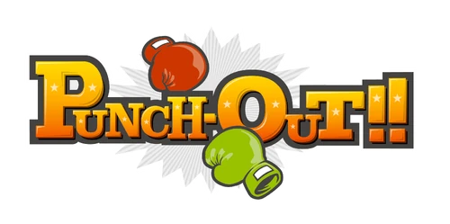

# Punch-Out!! Patch

Play **Punch-Out!!** (Wii) with a **Classic Controller** or a **GameCube
controller** instead of a Wii Remote. Works with the USA (`R7PE01`), Europe /
Australia (`R7PP01`) and Japan (`R7PJ01`) releases, and each patch is optional.

The patches are applied to your own copy of the game: drop a clean `.wbfs` or
`.iso` onto the patcher and play the result on a Wii (USB loader) or in Dolphin.
Nothing from the game is included in this repository.



## Status

Tested in Dolphin with scripted controller input. **Not yet tested on a real Wii.**

- Classic Controller: buttons, D-pad, left stick, right stick as the menu pointer
  (USA played into a fight; Europe and Japan booted and checked at the input level)
- GameCube pad: buttons, D-pad, control stick, C-stick as the menu pointer (USA)

Known limits:

- a Wii Remote must still be connected (the Classic Controller plugs into it; the
  GameCube pad is read by the console itself, but the game only runs its pad
  update for a channel with a remote)
- plug the GameCube pad in **before** starting the game
- the game is built for a sideways Wii Remote, so that is the layout you get; the
  motion-controlled punches are not emulated

## Controls

The game's remote-sideways layout. Directions are as you see them on screen.

| Classic | GameCube | Acts as |
| --- | --- | --- |
| D-pad / left stick | D-pad / control stick | Remote D-pad (dodge, block) |
| B | B | Button 1 |
| A | A | Button 2 |
| Y | Y | Button B |
| X | X | Button A (confirm, clicks the pointer) |
| + | Start | + (pause) |
| HOME | Z | HOME |
| Right stick | C-stick | Moves the menu pointer |

## Installing

Download the patcher for your system from the releases page, or run it from source
(Python 3 with tkinter and [Wiimms ISO Tool](https://wit.wiimm.de/) on your `PATH`):

```bash
python3 tools/gui.py
```

Tick the patches, drop the image onto the window. The patcher checks the disc id,
patches `sys/main.dol`, rebuilds the image in the same format and replaces your
file, keeping the original as `<name>.bak`. Other releases, and images already
modified by something else, are refused. Command line:

```bash
python3 tools/patch_disc.py "Punch-Out!! (USA).wbfs" --cc --gc
```

### Gecko codes (Dolphin)

Copy `codes/<disc id>.ini` into Dolphin's `GameSettings` folder and enable the
codes. Riivolution patches are in `riivolution/<disc id>.xml`.

## Building from source

```bash
PO_DOLS=/dir/with/R7PE01.dol,R7PP01.dol,R7PJ01.dol python3 tools/gen_prebuilt.py   # needs devkitPPC
python3 tools/build.py      # regenerate codes/ and riivolution/
python3 tools/check.py      # consistency checks, no game files needed
PO_DOLS=... python3 tools/verify.py   # checks every patch against the retail DOLs
```

How it works: [docs/TECHNICAL.md](docs/TECHNICAL.md).

## Credits

- Vague Rant, for the Classic Controller approach this builds on.
- The Gecko / WiiRD community for the code format.

## Contact

quatricsoftware@gmail.com. No support will be provided for this tool.

## License

MIT, see [LICENSE](LICENSE). Copyright (c) 2026 quatric
